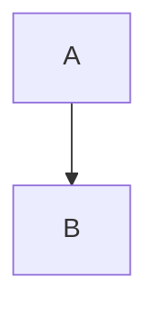

> Ein Zitat
> über zwei Zeilen.

> [!note] Hinweis
> Inhalt des Callouts mit **fett**.

> [!warning]- Eingeklappt
> Text.
>
> Zweiter Absatz.

> [!tip]
> Ohne Titel.

---

```ts
const x: number = 1
console.log(x)
```



~~~
Tilde-Fence ohne Sprache
~~~

    eingerückter Code

***

| Spalte A | Spalte B | Rechts |
| -------- | :------: | -----: |
| a1       | b1       | c1     |
| **a2**   | `b2`     | [[c2]] |


[bericht.pdf](Seite/_assets/bericht.pdf)

```bash
echo "Alias"
```

```toml
key = "wert"
```

```exotisch
unbekannte Sprache
```

- Liste mit Code:

  ```py
  print("verschachtelt")
  ```
